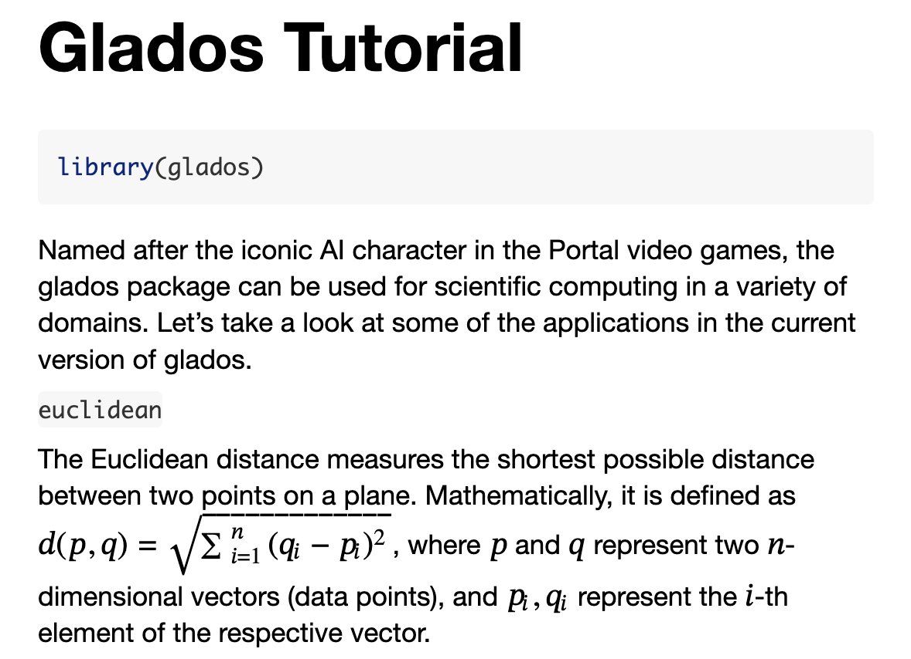

# Glados for Scientific Computing

[](https://github.com/KatherineWasmer/glados/actions/workflows/R-CMD-check.yaml)

[](https://app.codecov.io/gh/KatherineWasmer/glados)

Named after the iconic AI character in the Portal video games, the glados package can be used for scientific computing in a variety of domains--including (but not limited to):

-   Geography 🌎
-   Mathematics ♾
-   Data Analysis 🔎

For more in-depth information on how to incorporate glados with your research, please utilize the [vignette](file:///private/var/folders/np/r8bkr3hd3bsdsjvxgq559f0h0000gn/T/RtmpxUBGwk/preview-3f26b3537f8.dir/glados.html). If the hyperlink does not work, complete the following steps:

1.  Click on the [vignettes](https://github.com/KatherineWasmer/glados/tree/main/vignettes) folder in the main repo.
2.  Download the glados.rmd file.
3.  Open glados.rmd in RStudio.
4.  Knit the file and preview in HTML. The output should look like this:

{width="500"}

Since this is an emerging project that I hope to continuously update, all versions will be documented here, with brief descriptions of the new features.

(November 19, 2024) Version 0.1.0 includes the following functions:

`get_euclidean_distance()` - computes the Euclidean distance between two vectors

## Installation

You can install the development version of glados from [GitHub](https://github.com/) with:

``` r
install.packages("devtools") 
devtools::install_github("KatherineWasmer/glados")
```

Here is a simple example of how to load glados and utilize the functions.

``` r
> library(glados)
> get_euclidean_distance(c(1,2), c(3,4))
[1] 2.828427
```
