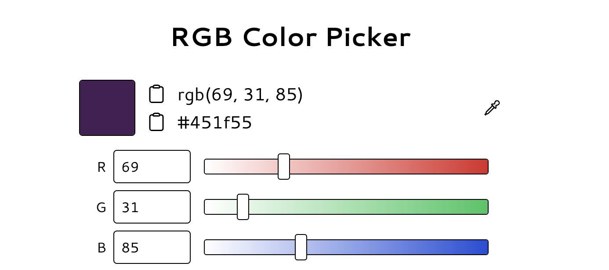

```{r, include = FALSE}
knitr::opts_chunk$set(
  collapse = TRUE,
  comment = "#>"
)
```

```{r setup}
library(glados)
```

Named after the iconic AI character in the Portal video games, the glados package can be used for scientific computing in a variety of domains. Let's take a look at some of the applications in the current version of glados.

`euclidean`

The Euclidean distance measures the shortest possible distance between two points on a plane. Mathematically, it is defined as $d(p, q) = \sqrt{\sum_{i = 1}^{n}(q_{i} - p_{i})^{2}}$, where $p$ and $q$ represent two $n$-dimensional vectors (data points), and $p_{i}, q_{i}$ represent the $i$-th element of the respective vector.

**Applications:**

Suppose we want to compute the shortest distance from Ann Arbor to Glacier Bay, Alaska, disregarding any geographic or human-made barriers. Ann Arbor's [DD coordinates](https://en.wikipedia.org/wiki/Decimal_degrees#:~:text=Decimal%20degrees%20(DD)%20is%20a,as%20OpenStreetMap%2C%20and%20GPS%20devices.) are ([42.27756, -83.74088](https://latitude.to/map/us/united-states/cities/ann-arbor)), while Glacier Bay's are ([58.6999972, -136.1499994](https://latitude.to/articles-by-country/us/united-states/31627/glacier-bay-basin)).

```{r euclidean_geography}
ann_arbor <- c(42.27756, -83.74088) 
glacier_bay <- c(58.6999972, -136.1499994)
get_euclidean_distance(ann_arbor, glacier_bay)
```

Using our geographical knowledge, this means that Glacier Bay is roughly 55 degrees northwest of Ann Arbor!

Another fun way to implement this function is with [RGB color channels](https://learn.microsoft.com/en-us/windows/win32/wcs/rgb-color-spaces). Suppose you are designing a website and love the color purple. You choose Russian violet for the background, but can't decide between black or white text. Based on the image, you might have an idea of which color would look best against this background, but let's test it with our function.

{width="500"}

```{r colors}
russian_violet <- c(69, 31, 85)
white <- c(255, 255, 255)
black <- c(0, 0, 0)
print(get_euclidean_distance(russian_violet, black))
print(get_euclidean_distance(russian_violet, white))
```

In color science, contrast is key! Since white has a significantly greater euclidean distance to Russian violet, it would be the better choice for the text color!

**Baseline Comparisons:**

Although the built-in `dist()` function returns the same values, the glados version improves upon its efficiency, both computationally and with regards to UX design.

```{r dist}
# original function 
dist(rbind(ann_arbor, glacier_bay), 'euclidean')[1][1]
```

Notice the extra steps taken to compute the distance? For users with little experience in R, `rbind()` may not be intuitive, and it takes time to figure out. Furthermore, we can only isolate the numerical result by indexing [1][1]; otherwise, we would simply return a 1 x 1 matrix with the row and column names included.

```{r matrix}
dist(rbind(ann_arbor, glacier_bay), 'euclidean')
```

These two problems are solved with glados. The user is not required to concatenate the matrix, and the results are returned with a straightforward number. Due to this optimized code, `get_euclidean_distance` returns improved benchmarks.

```{r benchmark}
if(!require(bench)) install.packages("bench",repos = "http://cran.us.r-project.org")
library(bench) 
bench::mark(get_euclidean_distance(ann_arbor, glacier_bay),
            dist(rbind(ann_arbor, glacier_bay), 'euclidean')[1][1])
```

```{r color}
bench::mark(get_euclidean_distance(russian_violet, white),
            dist(rbind(russian_violet, white), 'euclidean')[1][1])
```

Improved statistics in glados include the following:

-   Decrease in run time

-   Decreased amount of garbage collections (GC)

-   Increased number of iterations for better accuracy
